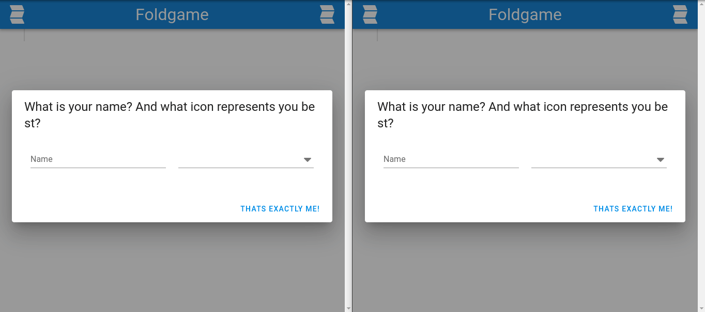

  <h1 href="https://github.com/joshmue/foldgame">
    ✏
  </h1>
  <h3 align="center">Foldgame</h3>
  

    Have some fun with shuffled stories!
  

## About The Project

"Foldgame" is a simple web implementation of the pre-existing game concept of:

1. writing down some answer to a question on a sheet of paper
2. passing the sheet of paper to the next player
3. repeating steps 1+2 until the series of follow-up questions ends
4. disclosing the own random story to the group by being "interviewed" by another player

While sometimes the results are just weird nonsense, often times they can be
the cause of amusement.

### Deployment

Foldgame is basically a simple SPA which opens a WebSocket to a server which
has no knowledge of game mechanics, but just serves as a hub for all incoming
JSON messages. See simple [Go implementation](./wsecho).

A reverse proxy may be set up to...
- handle authentification
- route `/ws` to `wsecho`
- route `/*` to a file server serving the built SPA.

### Limitations

Currently, there can be only a single concurrent game on each domain respectively WebSocket server.
Changing that would require implementing some sort of lobby management mechanics.

### Built With

Frontend:

* Vuetify
* FontAwesome
* json-patch
* and of course much more (it's JavaScript after all)

Backend:

* Go with Gorilla Websocket library
